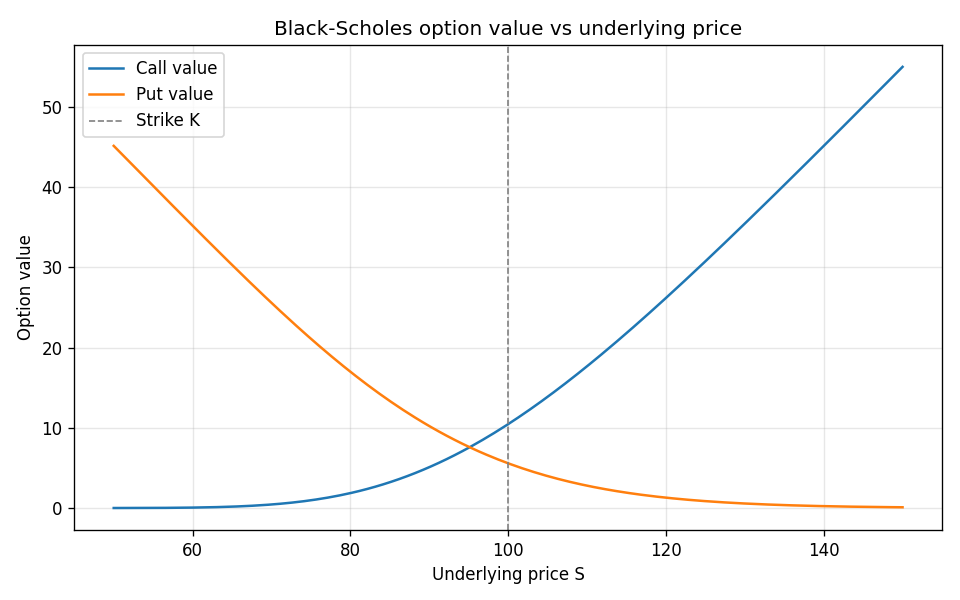
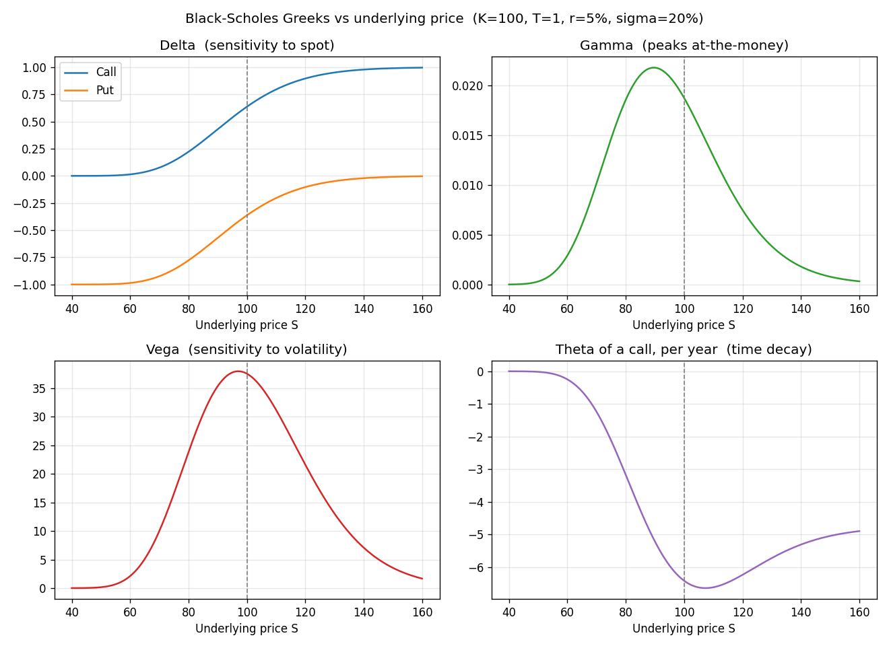
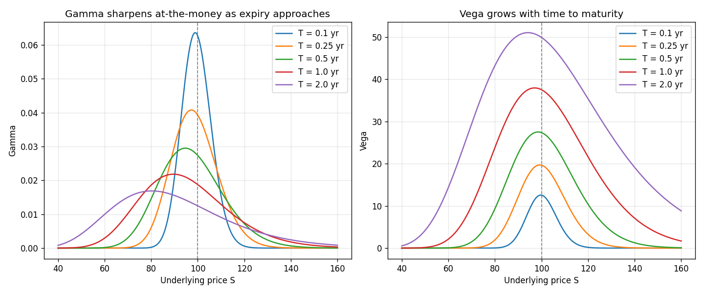
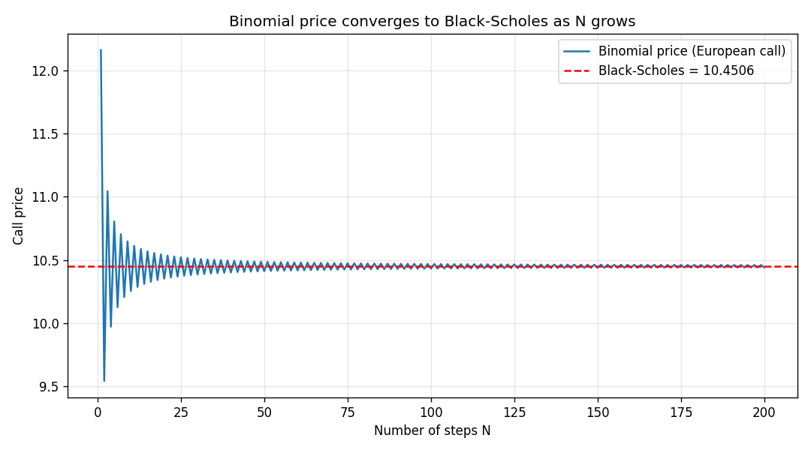
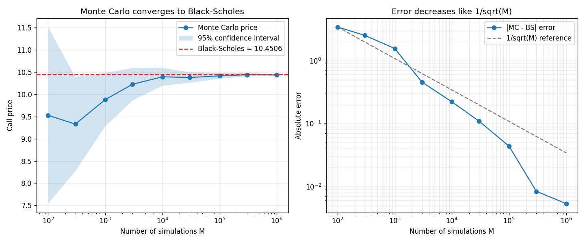

# options-pricing-engine

European & exotic option pricer: Black-Scholes, binomial tree, Monte Carlo, Greeks.

A from-scratch implementation of option pricing methods, built to make the
underlying mathematics explicit rather than hiding it behind a library call.

---

## Status / roadmap

- [x] **Black-Scholes** closed-form pricing of European calls & puts (with dividend yield)
- [x] **Greeks**: delta, gamma, vega, theta, rho (analytical)
- [x] **Greeks visualization** (curves vs spot and vs maturity)
- [x] **Binomial tree** pricing (European & American), converging to Black-Scholes
- [x] **Monte Carlo** pricing (antithetic variates, confidence interval, convergence)
- [ ] Exotic options (Asian, barrier) via Monte Carlo
- [ ] Implied volatility solver

This README is updated as each block is added.

---

## The model

Under Black-Scholes-Merton, the underlying price $S$ follows a geometric
Brownian motion:

$$dS = (r - q)\,S\,dt + \sigma\,S\,dW$$

The price of a European **call** and **put** is:

$$C = S e^{-qT} N(d_1) - K e^{-rT} N(d_2)$$
$$P = K e^{-rT} N(-d_2) - S e^{-qT} N(-d_1)$$

with

$$d_1 = \frac{\ln(S/K) + (r - q + \tfrac{1}{2}\sigma^2)T}{\sigma\sqrt{T}}, \qquad d_2 = d_1 - \sigma\sqrt{T}$$

where $N(\cdot)$ is the standard normal CDF, $r$ the risk-free rate, $q$ the
dividend yield, $\sigma$ the volatility and $T$ the time to maturity.

The **Greeks** measure how the price reacts to each input: delta to the spot,
gamma to delta, vega to volatility, theta to time, rho to the rate.

---

## Project structure

```
options-pricing-engine/
├── black_scholes.py   # core pricing + Greeks
├── demo.py            # runnable example (prices, Greeks, parity check, plot)
├── greeks_plots.py    # plots of the Greeks (vs spot and vs maturity)
├── binomial.py        # CRR binomial tree (European & American)
├── binomial_demo.py   # convergence to BS + early-exercise premium
├── monte_carlo.py     # Monte Carlo pricer (antithetic + confidence interval)
├── monte_carlo_demo.py # MC vs BS + convergence study
├── requirements.txt   # dependencies
└── README.md
```

## Installation

```bash
pip install -r requirements.txt
```

## Usage

```python
import black_scholes as bs

price = bs.bs_price(S=100, K=100, T=1, r=0.05, sigma=0.20, option_type="call")
print(price)            # 10.4506

g = bs.greeks(S=100, K=100, T=1, r=0.05, sigma=0.20, option_type="call")
print(g["delta"])       # 0.6368
```

Run the full demonstration:

```bash
python demo.py
```

Example output:

```
Call price : 10.4506
Put  price : 5.5735

Greeks (call):
  delta = 0.6368
  gamma = 0.0188
  vega  = 37.5240
  theta = -6.4140
  rho   = 53.2325

Put-call parity check: match: True
```



---

## Greeks visualization

Generated by `greeks_plots.py`.

The four core Greeks as a function of the underlying price:



- **Delta** runs from 0 to 1 for a call (0 to -1 for a put).
- **Gamma** and **vega** are bell-shaped and peak at-the-money.
- **Theta** (time decay) is most negative around the money.

Effect of time to maturity:



- **Gamma** sharpens into a tall, narrow peak at-the-money as expiry approaches.
- **Vega** grows with maturity: longer-dated options are more sensitive to volatility.

---

## Binomial tree (Cox-Ross-Rubinstein)

Time is split into `N` steps; at each step the underlying moves up by
$u = e^{\sigma\sqrt{\Delta t}}$ or down by $d = 1/u$. Pricing is done by
backward induction under the risk-neutral probability

$$p = \frac{e^{(r-q)\Delta t} - d}{u - d}$$

Unlike Black-Scholes, the tree prices **American** options: at every node it
takes the maximum of the continuation value and the immediate-exercise value.

```python
from binomial import binomial_price

binomial_price(S=100, K=100, T=1, r=0.05, sigma=0.20, N=1000,
               option_type="put", exercise="american")   # 6.0896
```

**Results from `binomial_demo.py`:**

- European call, binomial `N=1000` = 10.4486 vs Black-Scholes 10.4506 (converges).
- American put = 6.0896 vs European put 5.5715 -> **early-exercise premium ~0.52**.
- American call (no dividend) = European call: early exercise is never optimal.



The binomial price oscillates around and converges to the Black-Scholes value
as the number of steps increases.

---

## Monte Carlo

The risk-neutral terminal price of the underlying is simulated as

$$S_T = S_0 \exp\!\Big( (r - q - \tfrac{1}{2}\sigma^2)T + \sigma\sqrt{T}\,Z \Big), \quad Z \sim \mathcal{N}(0,1)$$

and the option price is the discounted average payoff over many simulations.
The estimate comes with a **standard error** and a **95% confidence interval**;
**antithetic variates** are used to reduce variance.

```python
from monte_carlo import mc_price_european

price, stderr, ci = mc_price_european(S=100, K=100, T=1, r=0.05,
                                      sigma=0.20, M=200_000, option_type="call")
```

**Results from `monte_carlo_demo.py`:**

- European call, MC (M=200k) = 10.4763, 95% CI [10.43, 10.52] -> contains Black-Scholes 10.4506.
- Antithetic variates cut the standard error by ~29% at equal M.
- The error decreases like $1/\sqrt{M}$ (to halve it, run 4x more paths).



---

## Notes

- Greeks are returned in their raw (per-unit) form. Common conventions:
  vega per +1% of vol = `vega / 100`, theta per day = `theta / 365`.
- Put-call parity ( $C - P = S e^{-qT} - K e^{-rT}$ ) is used in `demo.py`
  as an automatic correctness check.
