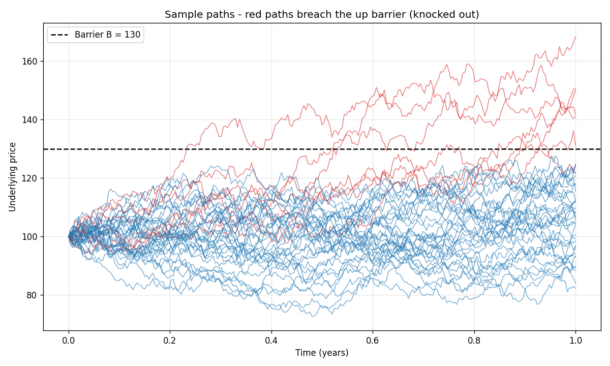
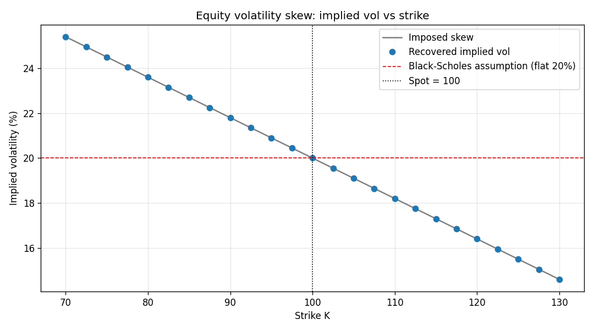

# options-pricing-engine

**Objective:** implement and cross-validate three standard methods for pricing European and exotic options — Black-Scholes (closed form), binomial tree (CRR), and Monte Carlo — building each from scratch to understand the mathematics behind derivatives pricing.

All results are validated against analytical references or financial identities (put-call parity, in-out parity, geometric Asian closed form).

---

## Step 1 — Black-Scholes pricing and Greeks

**`black_scholes.py` · `demo.py` · `greeks_plots.py`**

The Black-Scholes formula gives the exact price of a European option under the assumption that the underlying follows a geometric Brownian motion with constant volatility $\sigma$:

$$C = S e^{-qT} N(d_1) - K e^{-rT} N(d_2)$$

$$d_1 = \frac{\ln(S/K)+(r-q+\frac{1}{2}\sigma^2)T}{\sigma\sqrt{T}}, \qquad d_2 = d_1 - \sigma\sqrt{T}$$

**Implementation:** each term has a clear financial meaning — $Ke^{-rT}N(d_2)$ is the discounted strike weighted by the risk-neutral exercise probability $N(d_2)$, and $Se^{-qT}N(d_1)$ is the present value of receiving the stock conditional on exercise. Note that $N(d_1)$ (the delta) and $N(d_2)$ (the exercise probability) are often confused; the gap between them grows with $\sigma$ and $T$.

**Results** ($S=K=100$, $T=1$, $r=5\%$, $\sigma=20\%$, $q=0$):

```
Call = 10.4506    Put = 5.5735
Put-call parity:  C - P = 4.877  =  S - Ke^{-rT} = 4.877  ✓
```

The five Greeks are implemented analytically:

| Greek | Value | Meaning |
|---|---|---|
| Delta | 0.637 | +$0.64 per +$1 move in S; also the hedge ratio |
| Gamma | 0.019 | delta changes by 0.019 per +$1 in S |
| Vega  | 37.52 | +$0.375 per +1% in volatility |
| Theta | −6.41/yr | −$0.018 per calendar day |
| Rho   | 53.23 | +$0.53 per +1% in rate |

The Greeks are linked by the Black-Scholes PDE:

$$\Theta + \tfrac{1}{2}\sigma^2 S^2 \Gamma + (r-q)S\Delta - rV = 0$$

This enforces the **theta/gamma trade-off**: being long gamma (profiting from large moves in $S$) always costs theta (daily time decay). You cannot have one without the other.

**Plots:**


Delta's S-shape, and the bell-shaped gamma and vega peaking at-the-money, are all visible. Theta is most negative around the money, where the most time value remains.


As expiry approaches, gamma sharpens into a spike at-the-money — small moves in $S$ cause large changes in delta, making the hedge increasingly unstable. Vega does the opposite: it grows with maturity, since longer options have more time for volatility to impact the payoff.

---

## Step 2 — Binomial tree (CRR)

**`binomial.py` · `binomial_demo.py`**

Time $T$ is divided into $N$ steps of $\Delta t = T/N$. At each step the price moves up by $u = e^{\sigma\sqrt{\Delta t}}$ or down by $d = 1/u$ (CRR symmetry: $ud = 1$, so up then down returns to the starting price). The unique risk-neutral probability of an up move is:

$$p = \frac{e^{(r-q)\Delta t} - d}{u - d}$$

**Backward induction:** starting from the known payoffs at maturity, each node's value is:

$$V = e^{-r\Delta t}\bigl[p\,V_u + (1-p)\,V_d\bigr]$$

**American options:** at every node, compare the continuation value above with the immediate exercise payoff $\max(S-K,0)$ and take the maximum. This is the key advantage over Black-Scholes, which has no mechanism for early exercise.

**Results:**

```
European put (N=1000) =  5.5715   Black-Scholes = 5.5735  ✓
American put (N=1000) =  6.0896
Early-exercise premium = +0.5181
American call          = European call  (early exercise never optimal, no dividends)  ✓
```

The American put is worth more because the holder can exercise immediately to collect intrinsic value rather than wait. For a call without dividends, early exercise always sacrifices remaining time value, so it is never optimal — the American and European prices are exactly equal, confirmed numerically.


The price oscillates around the Black-Scholes value because the strike alternately falls on or between nodes as $N$ varies. The oscillations dampen quickly; at $N=1000$ the gap to Black-Scholes is 0.002.

---

## Step 3 — Monte Carlo

**`monte_carlo.py` · `monte_carlo_demo.py`**

For a European option the terminal price has an exact distribution under the risk-neutral measure:

$$S_T = S_0 \exp\!\Bigl((r-q-\tfrac{1}{2}\sigma^2)T + \sigma\sqrt{T}\,Z\Bigr), \quad Z\sim\mathcal{N}(0,1)$$

The price estimate is the discounted sample mean of payoffs over $M$ draws, with a 95% confidence interval.

**Two implementation details:**

*Antithetic variates:* each draw $Z$ is paired with $-Z$. The two payoffs are negatively correlated (one gives a high stock price, the other a low one), so their average has lower variance. This reduced the standard error by **29%** at equal computation cost.

*Correct standard error:* with antithetic pairs, the independent sampling units are the $M/2$ pair averages $\frac{1}{2}(g(Z)+g(-Z))$, not the $M$ raw payoffs. Computing SE on raw payoffs ignores within-pair correlation and underestimates uncertainty — this is a subtle bug I initially made and then fixed.

**Results** ($M = 200\,000$):

```
MC price = 10.4763    SE = 0.0234    95% CI [10.43, 10.52]
Black-Scholes = 10.4506  →  inside the CI ✓
Antithetic SE reduction vs plain MC: 29.4%
```

The error decreases as $1/\sqrt{M}$: halving it requires four times as many paths.


Left: the price estimate and confidence interval converge to Black-Scholes as $M$ grows. Right: error vs $M$ on a log-log scale, tracking the $1/\sqrt{M}$ reference line closely.

---

## Step 4 — Exotic options

**`exotics.py` · `exotics_demo.py`**

Path-dependent options require simulating complete price paths, since their payoff depends on the whole trajectory. Each step:

$$S_{t+\Delta t} = S_t\exp\!\Bigl((r-q-\tfrac{1}{2}\sigma^2)\Delta t + \sigma\sqrt{\Delta t}\,Z\Bigr)$$

**Asian options** pay on the average price: $\max(\bar{S}-K,0)$. They are cheaper than a vanilla because averaging smooths out volatility. The arithmetic average has no closed form (the average of log-normals is not log-normal), but the geometric average does — used here to validate the path engine before pricing the harder case.

```
Geometric Asian — closed form  = 5.5939
Geometric Asian — Monte Carlo  = 5.5962    95% CI [5.573, 5.620]  ✓
Arithmetic Asian — Monte Carlo = 5.8130
Vanilla call                   = 10.4506

Ordering: geometric ≤ arithmetic ≤ vanilla  ✓  (AM-GM inequality)
```

**Barrier options** expire (*knock-out*) or activate (*knock-in*) when the price crosses a level $B$. The in-out parity identity — knock-in + knock-out = vanilla — is tested on the *same* paths to eliminate Monte Carlo noise:

```
Up-and-out  (B=130) = 3.5691
Up-and-in   (B=130) = 6.9100
Sum = 10.4791  =  vanilla from same paths (10.4791)  ✓
```



Red paths breach the barrier (knocked out); blue paths survive. The barrier filters out the most favourable trajectories for the call holder, which is why the knock-out is cheaper than the vanilla.

*Limitation:* the barrier is checked only at discrete steps, so a path that crosses $B$ between two steps goes undetected, slightly underestimating the knock-out probability. More steps reduce this discretization bias.

---

## Step 5 — Implied volatility and the skew

**`implied_vol.py` · `implied_vol_demo.py` · `market_smile.py`**

The implied volatility is the $\sigma$ that makes Black-Scholes reproduce a given market price. Since the BS price is strictly increasing in $\sigma$ (vega $> 0$), a unique solution exists. Found numerically in two stages:

1. **Newton-Raphson:** $\sigma \leftarrow \sigma - \frac{BS(\sigma)-\text{price}}{\text{vega}(\sigma)}$, converges quadratically when vega is large.
2. **Brent bisection fallback:** used for deep OTM options where vega $\approx 0$ and Newton can diverge.

**Validation:** pricing 9 options with known $\sigma$, then recovering $\sigma$ from the price — maximum error $< 5\times10^{-10}$ across all cases ✓



If Black-Scholes were a perfect model, implied vol would be flat (red dashed line). In practice it slopes downward for equity indices: low-strike puts (crash protection) carry higher implied vol than the model predicts. This is the **equity skew** — the market prices in fat left tails and the possibility of sudden large drops that a Gaussian model cannot capture. The skew is one of the clearest empirical failures of constant-volatility Black-Scholes.

`market_smile.py` builds this plot from live option data via `yfinance`, comparing our solver to market quotes directly.

---

## Step 6 — Cross-method validation

**`compare_methods.py`**

The same European call priced by all three methods across five strikes:

```
Strike  Black-Scholes  Binomial  Monte Carlo  max gap
    80         24.589    24.589       24.581    0.008
    90         16.699    16.700       16.686    0.013
   100         10.451    10.449       10.431    0.019
   110          6.040     6.042        6.022    0.018
   120          3.247     3.248        3.237    0.010
```

Maximum disagreement: **0.02** — Monte Carlo sampling noise that shrinks with more paths. Three completely independent approaches (analytical, discrete, probabilistic) converging to the same numbers is the strongest possible correctness check.


---

## How to run

```bash
pip install -r requirements.txt

python demo.py               # Black-Scholes prices, Greeks, put-call parity
python greeks_plots.py       # Greek curves vs spot and maturity
python binomial_demo.py      # tree convergence + American options
python monte_carlo_demo.py   # Monte Carlo convergence
python exotics_demo.py       # Asian & barrier options with validations
python implied_vol_demo.py   # implied vol solver + skew
python compare_methods.py    # all three methods side by side
```
